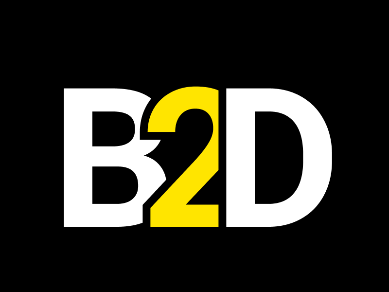

<h1 align="center">Bin2Dec</h1>

<h3 align="center">Simples conversor de binário para decimal</h3>

<h2 align="center">Link para o app: <a href="https://gabrielnbds.github.io/Bin2Dec/"> https://gabrielnbds.github.io/Bin2Dec/ </a> </h2>

<p align="center">
  
</p>

 Para rodar o projeto localmente, rode ```yarn start``` 


A ideia desse projeto foi retirada do App Ideas Collection. Repositório deles: <a href="https://github.com/florinpop17/app-ideas"> https://github.com/florinpop17/app-ideas </a>
